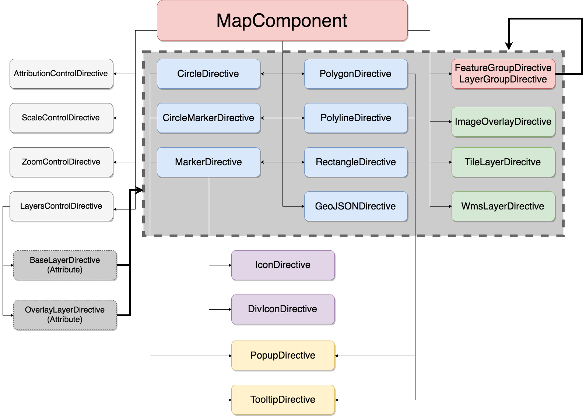

# YAGA - leaflet-ng2

[](https://travis-ci.org/yagajs/leaflet-ng2)
[](https://coveralls.io/github/yagajs/leaflet-ng2?branch=master)
[](https://app.fossa.io/projects/git%2Bgithub.com%2Fyagajs%2Fleaflet-ng2?ref=badge_shield)

YAGA leaflet-ng2 is a granular implementation of the popular [Leaflet](http://leafletjs.com/) framework into the model
view view controller (MVVC) of [Angular.io](https://angular.io/). It provides a directive for every Leaflet class that belongs to the user interface by inheriting the original Leaflet class and enhancing it with the decorators of Angular and glue-code. With this approach the directives are still extensible and it is possible to write the structure of an app in a descriptive way in a well known markup language,
HTML5. This is why you mainly need HTML skills for creating a template based geo-app with leaflet-ng2.

It is easy to enhance this library with one’s own Angular modules, because of its modular structure. It is
even possible to use the already existing Leaflet plugins on top, because the implementation also detects changes that
were made in Leaflet and bind them to Angular’s data model.

The YAGA Development-Team gives a great importance to tests, test-coverage, documentation, examples and getting started
templates.

## How to use

First you have to install this library from npm:

```bash
npm install --save @yaga/leaflet-ng2
```

This module works like a normal Angular 2 module. You should do something like that:

```typescript
import { YagaModule, OSM_TILE_LAYER_URL }   from '@yaga/leaflet-ng2';
import { Component, NgModule, PlatformRef } from '@angular/core';
import { BrowserModule }                    from '@angular/platform-browser';
import { platformBrowserDynamic }           from '@angular/platform-browser-dynamic';

const platform: PlatformRef = platformBrowserDynamic();

@Component({
    selector: 'app',
    template: `<yaga-map><yaga-tile-layer [(url)]="tileLayerUrl"></yaga-tile-layer></yaga-map>`
})
export class AppComponent {
    // Your logic here, like:
    public tileLayerUrl: string = OSM_TILE_LAYER_URL;
}

@NgModule({
    bootstrap:    [ AppComponent ],
    declarations: [ AppComponent ],
    imports:      [ BrowserModule, YagaModule ]
})
export class AppModule { }

document.addEventListener('DOMContentLoaded', () => {
    platform.bootstrapModule(AppModule);
});
```

*Do not forget to import the leaflet css!*


After that you should be able to use the following directives or components:

* `yaga-map` *This must be the root component!*
* `yaga-attribution-control`
* `yaga-circle`
* `yaga-circle-marker`
* `yaga-div-icon`
* `yaga-feature-group`
* `yaga-geojson`
* `yaga-icon`
* `yaga-image-overlay`
* `yaga-layer-group`
* `yaga-layers-control` with `[yaga-base-layer]` and `[yaga-overlay-layer]`
* `yaga-marker`
* `yaga-polygon`
* `yaga-polyline`
* `yaga-popup`
* `yaga-rectangle`
* `yaga-scale-control`
* `yaga-tile-layer`
* `yaga-tooltip`
* `yaga-zoom-control`



For further information look at the [api documentation](https://leaflet-ng2.yagajs.org/latest/typedoc/) or the
[examples](https://leaflet-ng2.yagajs.org/latest/examples/).


### Use in combination with a CLI

For developing we recommend to use a command-line-interface like [`angular-cli`](https://cli.angular.io/) for
web-applications or [`ionic`](http://ionicframework.com/) for smartdevice-like apps.

*You can also check out our [ionic-starter templates](https://github.com/yagajs/?q=ionic-starter) on our GitHub account*

#### Start a project with Angular CLI

You have to perform the followings steps to start a project with the [`angular-cli`](https://cli.angular.io/):

```bash
# Install the angular-cli to your system
npm install -g angular-cli
# Create a app with the angular-cli
ng new my-yaga-app
# Switch into the created project directory
cd my-yaga-app
# Install @yaga/leaflet-ng2 as project dependency
npm install --save @yaga/leaflet-ng2
```

Import the YAGA module into your app in `app.module.ts`:

```typescript
// other imports...
import { YagaModule } from '@yaga/leaflet-ng2';

// ...

@NgModule({
  imports: [
    // other...
    YagaModule,
  ],
  // some other properties...
)
export class AppModule { }
```

#### Start a project with Ionic CLI

You have to perform the followings steps to start a project with the [`ionic-cli`](http://ionicframework.com/):

```bash
# Install the ionic-cli to your system
npm install -g ionic
# Create a app with the ionic-cli (select a template unteractive)
ionic start my-yaga-app
# Switch into the created project directory
cd my-yaga-app
# Install @yaga/leaflet-ng2 as project dependency
npm install --save @yaga/leaflet-ng2
```

Import the YAGA module into your app in `app.module.ts`:

```typescript
// other imports...
import { YagaModule } from '@yaga/leaflet-ng2';

// ...

@NgModule({
  imports: [
    // other...
    YagaModule,
  ],
  // some other properties...
)
export class AppModule { }
```

### Use standard Leaflet plugins

You are able to integrate other Leaflet plugins (not prepared for the use with Angular) by importing the
map directive into your parent directive like this:

```typescript
@Component({
    selector: 'app',
    template: `<yaga-map><!-- ... --></yaga-map>`
})
export class AppComponent implements AfterViewInit {
    @ViewChild(MapComponent) private mapComponent: MapComponent;
    public ngAfterViewInit(): void {
        const myFancyLeafletPlugin = (L as any).myFancyLeafletPlugin({ /* ... */ });
        this.mapComponent.addSomething(myFancyLeafletPlugin);
    }
}
```

*For further information, take a look at the
[according issue on GitHub](https://github.com/yagajs/leaflet-ng2/issues/251)*

#### Write as a YAGA Module

To write an existing extension as a YAGA directive is made as easy as possible. Your Leaflet-Plugin of choice should
already have a TypeScript type-definition. At first take a look which Leaflet base-class your Leaflet-Plugin of choice
implements. Than copy the implementation and software-tests of the according base-class in this repository and enhance
it accordingly to the given schema.

#### List of providers

* `MapProvider` - Inject this provider for classes that have to interact with the `Map` class and not with a
`LayerGroup`. `Controls` typically use the `MapProvider`
* `LayerGroupProvider` - Inject this provider for classes that implements `Layers`. Note that the `Map` also provides
a `LayerGroupProvider`, but it is `@Host` and you are not able to request a higher one in the dependency-chain.
* `LayerProvider` - Every class that implements `Layer` should have a `LayerProvider` to give for example `Popup`s the
possibility to get access to this.
* `MarkerProvider` - Use this to add `Icon`s.

#### Example

Every class that extends a layer in Leaflet must provide a `LayerProvider`. Layers in Leaflet needs typically a `Map` or
`LayerGroup` to have the possibility to add it to that (`layer.addTo(MapOrLayerGroup)`). So every instance of a
`LayerGroup` must provide a `LayerGroupProvider`.

With the information of the above mentioned architecture, you have to implement a `LayerGroupDirective` (which is
extended from Leaflet's `LayerGroup` class, which is - in turn - extended from Leaflet's `Layer`) like this:

```typescript
import { Directive, SkipSelf } from '@angular/core';
import { LayerGroupProvider, LayerProvider } from '@yaga/leaflet-ng2';
import { FeatureGroup } from 'leaflet';

@Directive({
    providers: [ LayerGroupProvider, LayerProvider ], // Provide a new Layer and LayerGroup
    selector: 'yaga-feature-group',
})
export class FeatureGroupDirective extends FeatureGroup {

    constructor(
        @SkipSelf() parentLayerGroupProvider: LayerGroupProvider, // Use SkipSelf to access the parent provider
        layerGroupProvider: LayerGroupProvider, // Import new Provider to reference this class
        layerProvider: LayerProvider, // Import new Provider to reference this class
    ) {
        super();

        layerProvider.ref = this; // Reference this class to created provider
        layerGroupProvider.ref = this; // Reference this class to created provider

        this.addTo(parentLayerGroupProvider.ref); // Add it to parent LayerGroup (which can also be a map)
    }
}
```


## Scripts Tasks

Scripts registered in package.json:

* `init`: Install all stuff needed for development (Typings, libs etc.)
* `clean`: Remove the stuff from init-task
* `reinit`: Call clean and init
* `transpile`: Transpile TypeScript Code to JavaScript
* `lint`: Use the linter for TypeScript Code
* `test`: Run software- and coverage-tests in node.
* `browser-test`: Build the tests for the browser.
* `build-examples`: Build the examples.
* `doc`: Build the API documentation.

*Every command is also available as dockerized version, by prefixing `docker:` (ex.: `docker:lint`)*

## License

This library is released under the [ISC License](LICENSE).


[](https://app.fossa.io/projects/git%2Bgithub.com%2Fyagajs%2Fleaflet-ng2?ref=badge_large)

## Links

* [YAGA-Website](https://yagajs.org)
* [Project-Website](https://leaflet-ng2.yagajs.org)
* [Unit-Tests](https://leaflet-ng2.yagajs.org/latest/browser-test/)
* [Test-Coverage](https://leaflet-ng2.yagajs.org/latest/coverage/)
* [API-Documentation](https://leaflet-ng2.yagajs.org/latest/typedoc/)
* [GitHub](https://github.com/yagajs/leaflet-ng2)
* [NPM](https://www.npmjs.com/package/@yaga/leaflet-ng2)
* [Workshop with Ionic 2](https://github.com/atd-schubert/leaflet-ng2-workshop-froscon/tags)
* [Video-Playlist (YouTube)](https://www.youtube.com/playlist?list=PLbpJoccrLTc00EXHFVIMTpIV_mYwb7IZW)
